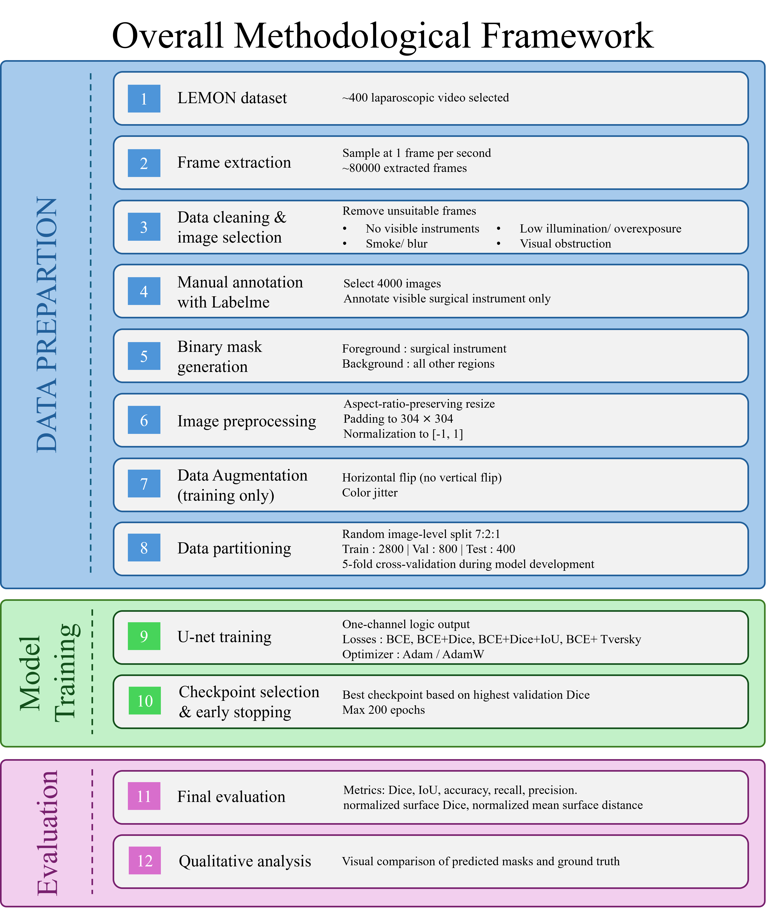

# Semantic Segmentation of Surgical Instruments in Laparoscopic Videos

## U-Net Image Segmentation Training Pipeline

This project provides a PyTorch training pipeline for binary semantic segmentation using a U-Net model. It supports aspect-ratio-preserving preprocessing, data augmentation, K-fold cross-validation, test-set evaluation, qualitative result visualisation, and learning-curve experiments with different fractions of the training data.



## Project Files

| File | Description |
|---|---|
| `main.py` | Main entry point. Creates fraction-based training subsets, runs K-fold experiments, summarises the results, and generates learning-curve plots. |
| `dataloader.py` | Reads image-mask pairs, resizes and pads them while preserving aspect ratio, applies augmentation and normalisation, and creates PyTorch datasets and data loaders. |
| `dataset_sampling.py` | Loads the full training/validation list and saves sampled subsets as text files. |
| `model.py` | Defines the U-Net architecture, including the encoder, decoder, skip connections, and output layer. |
| `run_kfold.py` | Performs K-fold training, validation, checkpointing, early stopping, learning-rate scheduling, and fold-level test evaluation. It also provides Adam/AdamW and multiple loss formulations. |
| `prediction_result.py` | Computes test metrics, removes padded regions before evaluation, saves per-sample results, and generates best, median, and worst qualitative examples. |
| `learning_curve_plot.py` | Reads the learning-curve summary CSV file and plots validation metrics, test metrics, training time, GPU memory use, and the best epoch. |

## Main Features

- Binary U-Net segmentation
- Aspect-ratio-preserving resize and padding
- Optional geometric and colour augmentation
- Fixed K-fold cross-validation
- Adam and AdamW optimisers
- BCE, BCE + Dice, BCE + Dice + IoU, BCE + Tversky, and custom weighted multi-loss settings
- Early stopping and `ReduceLROnPlateau`
- Automatic mixed-precision training on CUDA devices
- Dice, IoU, precision, recall, accuracy, normalised surface distance, and normalised surface Dice
- Fraction-based learning-curve experiments
- Model checkpoints, CSV logs, plots, and qualitative overlays

## Requirements

Python 3.9 or later is recommended.

Install the required packages with:

```bash
pip install torch torchvision numpy pillow scipy scikit-learn matplotlib
```

For GPU training, install a PyTorch build that is compatible with the CUDA version available on the system.

## Dataset Format

Prepare two text files:

```text
train_val.txt
test.txt
```

Each line must contain an image path followed by its corresponding mask path:

```text
/path/to/image_001.png /path/to/mask_001.png
/path/to/image_002.png /path/to/mask_002.png
```

The paths are separated by whitespace, so file and folder names should not contain spaces.

For binary segmentation, every non-zero mask pixel is treated as foreground and converted to `1`; background pixels are converted to `0`.

## Recommended Project Structure

```text
project/
├── main.py
├── dataloader.py
├── dataset_sampling.py
├── learning_curve_plot.py
├── model.py
├── prediction_result.py
├── run_kfold.py
├── train_val.txt
└── test.txt
```

## Usage

### 1. Set the dataset paths

Edit the paths in `main.py`:

```python
trainval_txt = "./train_val.txt"
test_txt = "./test.txt"
```

### 2. Set the learning-curve fractions

```python
subset_values = [0.125, 0.25, 0.35, 0.50, 1.00]
```

These values represent 12.5%, 25%, 35%, 50%, and 100% of the available training/validation samples. The subsets are nested, so a larger subset contains the samples used by the smaller subsets.

### 3. Configure training

The main settings are stored in `base_config` in `main.py`:

```python
base_config = {
    "n_splits": 5,
    "batch_size": 12,
    "target_size": [384, 384],
    "learning_rate": 1e-4,
    "optimizer_name": "AdamW",
    "weight_decay": 1e-4,
    "max_epochs": 200,
    "patience": 8,
    "normalize_mode": "fixed_05",
    "augment_train": True,
}
```

Useful configuration options include:

| Setting | Available values or purpose |
|---|---|
| `n_splits` | Number of K-fold splits; must be at least 2. |
| `optimizer_name` | `"Adam"` or `"AdamW"`. |
| `loss_type` | `"bce"`, `"bce_dice"`, `"bce_dice_iou"`, `"bce_tversky"`, or `"multi"`. |
| `bce_weight`, `dice_weight`, `iou_weight`, `tversky_weight` | Weights assigned to the loss components. |
| `binary_pos_weight` | Increases the BCE penalty for positive foreground pixels. |
| `early_stop_monitor` | `"val_dice"`, `"val_loss"`, or `"train_loss"`. |
| `scheduler_monitor` | `"val_dice"`, `"val_loss"`, or `"train_loss"`. |
| `crop_padding_for_train_loss` | Excludes padded regions from training-loss calculation when enabled. |
| `loss_reduction_mode` | `"sample_mean"` or `"pixel_weighted"`. |
| `normalize_mode` | `"none"` or `"fixed_05"`. |
| `use_amp` | Enables automatic mixed precision when CUDA is available. |

When a custom multi-loss is used, the component weights should normally sum to `1.0` for easier interpretation.

### 4. Run the experiment

```bash
python main.py
```

The program will:

1. Read all samples from `train_val.txt`.
2. Create a nested subset for each requested training-data fraction.
3. Run K-fold training and validation for each subset.
4. Save the best checkpoint according to validation Dice.
5. Evaluate every fold's best checkpoint on the optional held-out test set.
6. Save fold-level metrics, plots, and ranked qualitative examples.
7. Aggregate the results and generate learning-curve plots.

## Output Structure

A timestamped output directory is created automatically, for example:

```text
learning_curve_20260806_123000/
├── learning_curve_config.json
├── learning_curve_summary.csv
├── val_dice_vs_fraction.png
├── val_iou_vs_fraction.png
├── test_dice_vs_fraction.png
├── test_iou_vs_fraction.png
├── train_time_vs_fraction.png
├── gpu_peak_memory_vs_fraction.png
├── best_epoch_vs_fraction.png
├── frac_12p5/
│   ├── trainval_subset_frac_12p5.txt
│   └── kfold_run/
│       ├── kfold_summary.csv
│       ├── all_folds_test_results.csv
│       ├── all_folds_test_summary.csv
│       ├── all_folds_test_metrics.png
│       └── fold_1/
│           ├── train_samples.txt
│           ├── val_samples.txt
│           ├── best_model.pth
│           ├── last_model.pth
│           ├── epoch_log.csv
│           ├── fold_1_loss_curve.png
│           ├── fold_1_dice_curve.png
│           ├── fold_1_iou_curve.png
│           └── test_results/
│               ├── per_sample_metrics.csv
│               ├── selected_cases.csv
│               ├── test_metrics.png
│               ├── test_summary.png
│               └── ranked_cases/
└── ...
```

## Notes

- The test set is evaluated separately and is not included in the K-fold train/validation splits.
- Images and masks are resized with their aspect ratio preserved and are then padded to the configured target size.
- Bilinear interpolation is used for images, while nearest-neighbour interpolation is used for masks.
- Validation and test metrics are calculated after removing padded regions.
- Binary predictions use a sigmoid probability threshold of `0.5`.
- Training time increases substantially with the number of subsets, folds, and epochs. A small subset and a low epoch limit can be used for an initial pipeline check.
- Setting `num_workers=0` is often safer in notebook environments or on Windows, although a larger value may improve data-loading speed on other systems.
